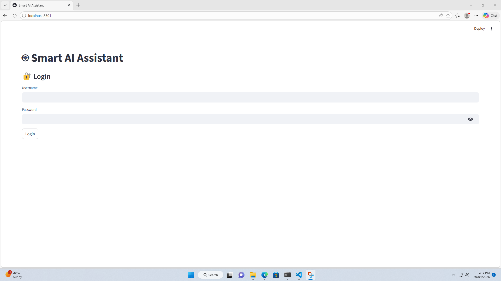
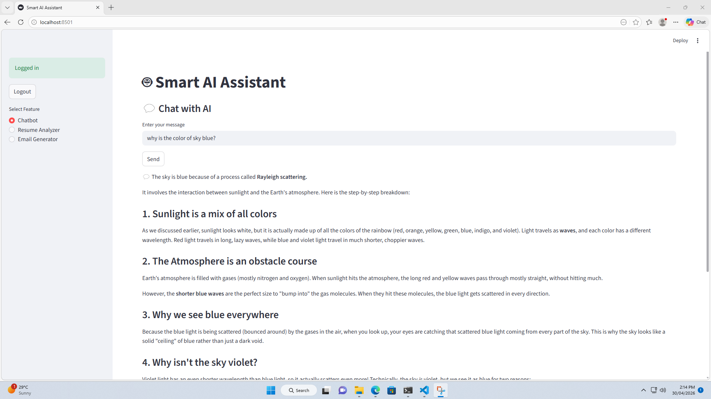
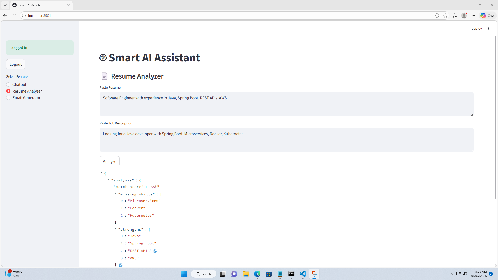
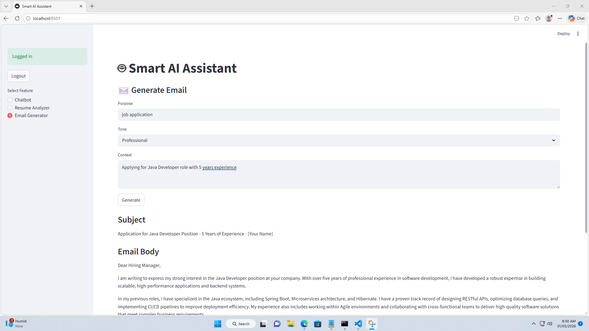

# 🤖 Smart AI Assistant

An AI-powered full-stack application built with FastAPI and Streamlit that provides intelligent services like Resume Analysis, Email Generation, and Chatbot interaction using Gemini LLM.

---

## 🚀 Features

- 🔐 JWT Authentication
- ⚡ Rate Limiting
- 💬 AI Chatbot with Memory
- 📄 Resume Analyzer (AI-based insights)
- ✉️ Email Generator (professional emails)
- 🧠 Gemini LLM Integration
- 🖥️ Streamlit Frontend UI

---

## 🏗️ Architecture

Backend:
- FastAPI
- Controller → Service → Repository pattern
- JWT Security + Rate Limiting

Frontend:
- Streamlit UI

AI Layer:
- Gemini LLM (Google GenAI)

---

## 📁 Project Structure
smart-ai-assistant/
├── backend/
│ └── src/
│ ├── controllers/
│ ├── services/
│ ├── repositories/
│ ├── schemas/
│ └── main.py
│
├── frontend/
│ └── app.py
│
├── requirements.txt
└── README.md

---

## ⚙️ Setup Instructions

### 1. Clone repo
git clone https://github.com/your-username/smart-ai-assistant.git

cd smart-ai-assistant

---

### 2. Create virtual environment
python -m venv venv
venv\Scripts\activate # Windows

---

### 3. Install dependencies
pip install -r requirements.txt

---

### 4. Run Backend
cd backend
uvicorn src.main:app --reload

---

### 5. Run Frontend
cd frontend
streamlit run app.py

---

## 🔗 API Endpoints

- `/auth/login`
- `/ai/analyze`
- `/ai/generate-email`
- `/ai/chat`

Swagger:http://127.0.0.1:8000/docs

---

## 🖼️ Screenshots

### 🔐 Login

### 💬 Chatbot

### 📄 Resume Analyzer

### ✉️ Email Generator

---

## 🧠 Key Learnings

- Built modular backend architecture
- Integrated LLM (Gemini) into real-world APIs
- Implemented authentication and rate limiting
- Designed full-stack AI application

---

## 🚀 Future Improvements

- Redis for scalable memory
- Vector DB (RAG system)
- Deployment (AWS / Render)
- File upload (PDF resume parsing)

---

## 👨‍💻 Author

Your Name  
GitHub: https://github.com/your-username

---
